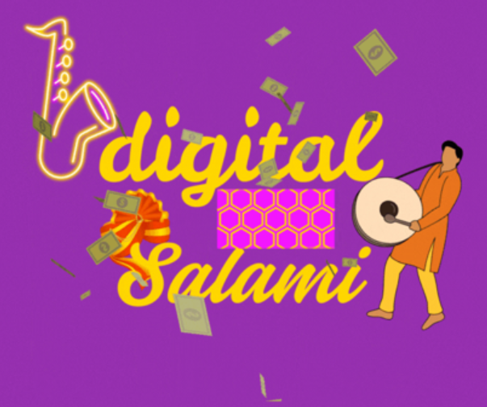
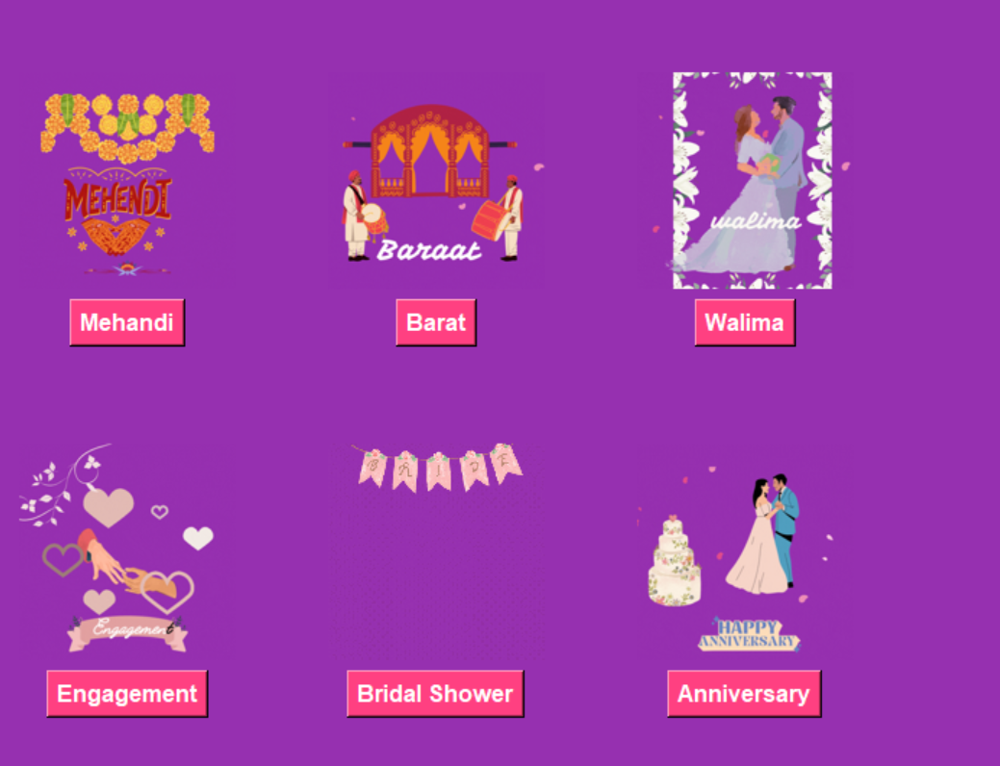
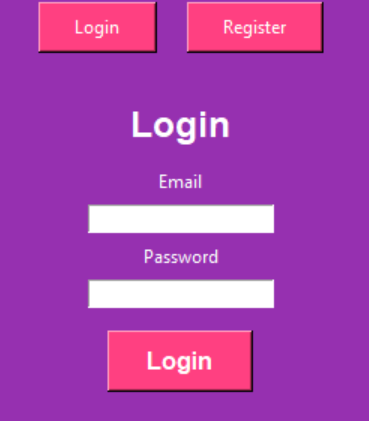

# 💸🎉 Digital Salami

**Digital Salami** is a shaadi-themed desktop app that brings the tradition of Salami into the modern, cashless world — with a fun, cultural twist. Whether it’s a Mehndi or a Walima, skip the envelope and send love instantly. 💜

---

## 🚀 Just an MVP – The Beginning of a Bigger Vision

This is an **MVP (Minimum Viable Product)** — the foundation of a much larger vision.  
We're exploring how tech can preserve our traditions while modernizing the experience for today's generation.

Stay tuned for mobile versions, QR payments, invitation integrations, and more.

---

## 🌟 The Idea

Inspired by a viral LinkedIn post — “From Envelopes to QR Codes: A New Era of Wedding Salami” — this app was born from a simple realization:

> "Why not make digital salami a norm?"

---

## 🎯 Why Digital Salami?

✅ No more forgotten envelopes  
✅ Trackable transactions  
✅ Instant and secure transfers  
✅ Promotes financial inclusion  
✅ Keeps the **essence** of tradition alive

---

## 🧠 Features in MVP

- 👤 User registration & login (with SQLite)
- 🎭 Event selection: Mehndi, Nikah, Walima, Bridal Shower
- 🎞️ Cute animated GIFs for each event
- 🔐 Email verification via 6-digit code
- 💻 Desktop-friendly GUI using Python Tkinter

---

## 🛠 Tech Stack

| Tool | Use |
|------|-----|
| Python | Core backend logic |
| Tkinter | GUI (Desktop App) |
| SQLite | Local database for user data |
| Canva GIFs | Event visuals and vibe |

---

## 🖼 Screenshots

### 🔹 Welcome Screen  

### 🔹 Event Selection  

### 🔹 Login/Register  

---

## 👩‍💻 Made with Grit by Manahil

I’m **Manahil** — a self-taught developer transitioning from BS English to Computer Science.  
After discovering tech through personal curiosity (and some career misguidance), I’m now building cultural, meaningful digital products with heart.

🔗 [LinkedIn: @manahilxsalami](https://www.linkedin.com/in/manahilxsalami)  
📍 Pakistan | #WomenInTech #PakistaniStartups

---

## 🤝 Collaborate or Support

> This is just the start. The goal? Build the future of cultural fintech from underrepresented places.

- ⭐ Star this repo  
- 🍴 Fork or contribute  
- 📢 Share with your shaadi squad  
- 💌 Email me for collabs, partnerships, or mentorships

---

> “This is not just an app. It's a movement — where culture meets code.”  
> — *Manahil, Founder of Digital Salami*

# digital-salami
Shaadi-themed digital cash gifting app (inspired by Pakistani traditions)
